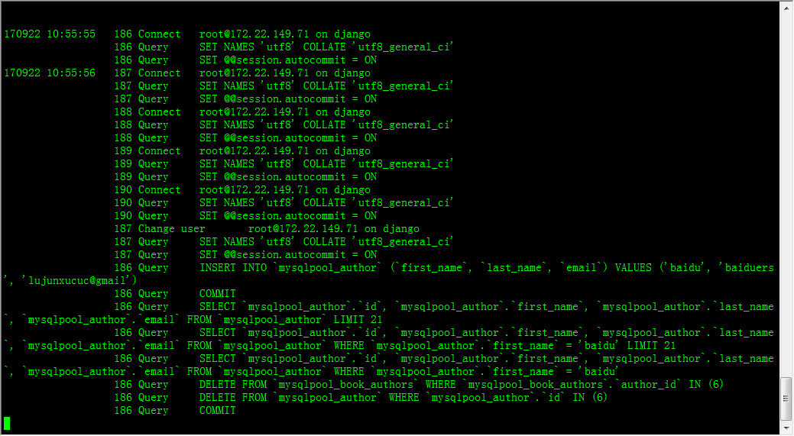
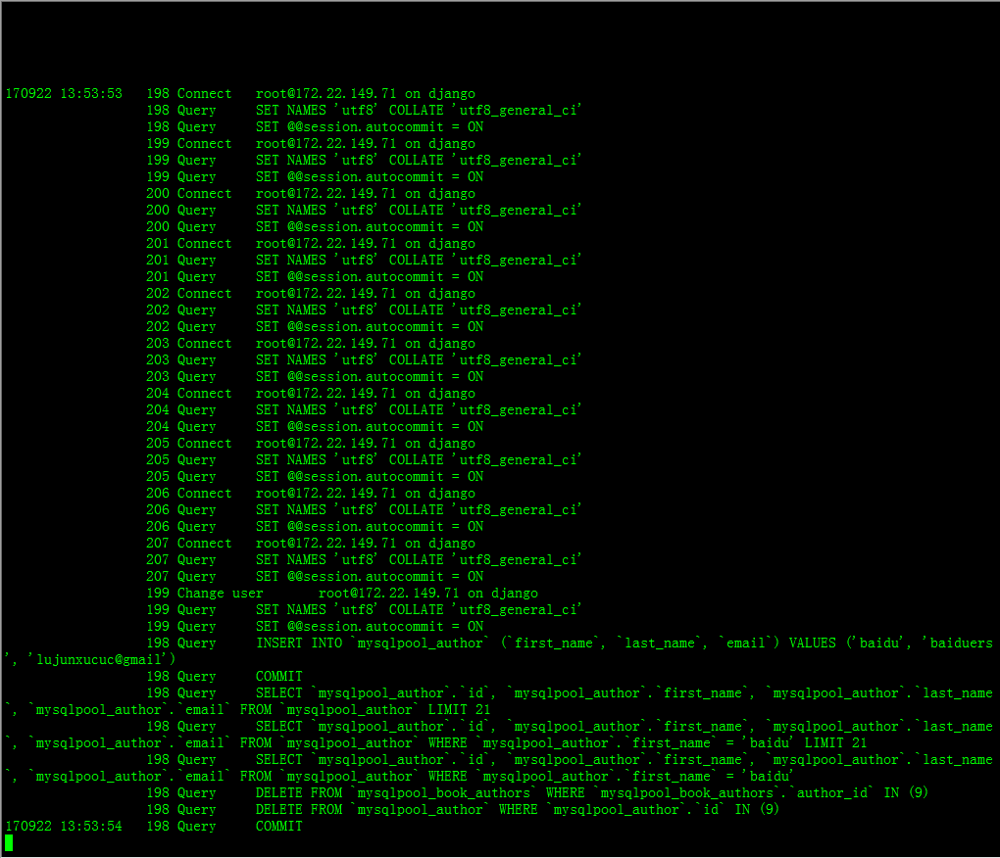
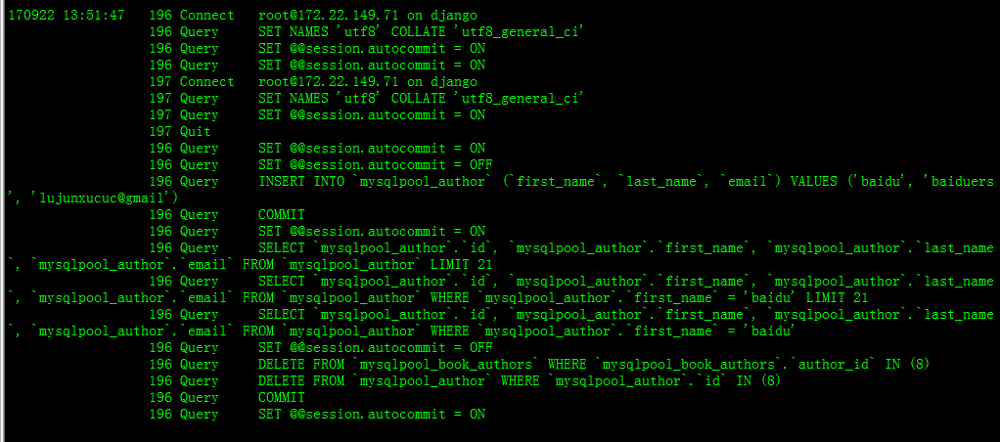

# Django-pool-showcase

Django-pool-showcase!

  - Django version 1.11.5
  - run with db type mysql.
  - run with mysql pool=> [PyMysqlPool](https://github.com/LuciferJack/python-mysql-pool).

# 中文

  - 运行的Django 版本是 1.11.5。
  - 运行的数据库类型是mysql。
  - 运行的数据库连接池是=>[PyMysqlPool](https://github.com/LuciferJack/python-mysql-pool)。

# img show
* use dynamic pool

* use fixed 10 sized pool

* use no pool(directly connect)

# vs django default engine
* 'ENGINE': 'django.db.backends.mysql', no pool effect and direct connected

